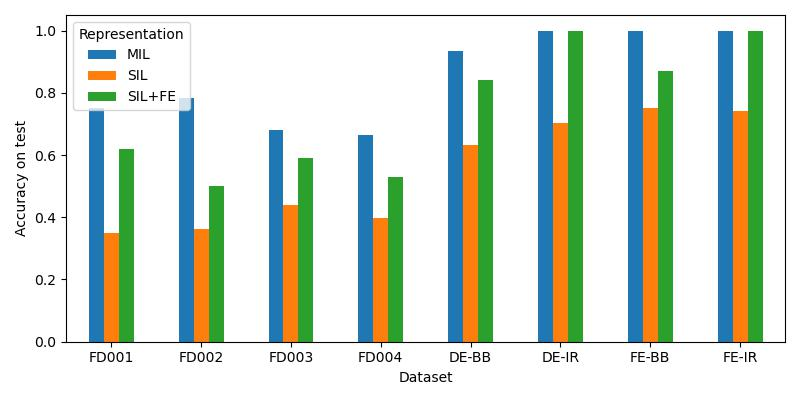
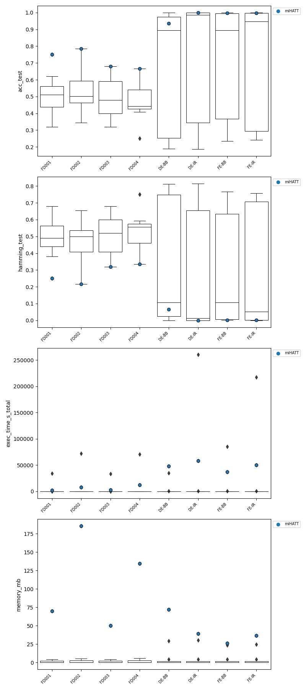

# MIDT4PdM

Associated repository with complementary material to the manuscript [Multi-instance learning and incremental decision trees for fault detection in industrial equipment], under review in *JOURNAL*. In this repository you will find:

* Source code of the proposed XX
* Datasets used in the experimentation
* Complete tables of results

The aim of the proposal developed in this work is the Time Series Classification in a context of a industrial system under a performance degradation. Due to the intense data generation environment, the model learns in a weak supervised manner.

## Source code

The code of the proposal has been depeloped in Python >=3.10, using the [River](https://riverml.xyz/latest/) library for the base implementation of the *Hoeffding Anytime Tree*. The complete list of libraries and dependencies of the project is specified in the file [requirements.yml](src/requirements.yml).

For a quick start tutorial of the proposal, the [tutorial.ipynb](src/tutorial.ipynb) describes the complete workflow to start using miHATT, from the loading data process, building and testing the model, and accessing to the interpretability resources.

The complete code generated for this proposal is available under the [src](src/) folder following the structure:

```plain
src
│   requirements.yml
│   tutorial.ipynb
│
└───mihatt.py
│   │   MultiInstanceHATT > Implementation of the proposed method
│
└───utils.py > Auxiliary functions for loading data
│
└───dataprep > Auxiliary functions to prepare the original data for the problem
    │   cmapss_preprocess.py
    │   cwru_preprocess.py

```

## Datasets

This work has been tested in two public and popular predictive maintenance problems: [NASA Ames Turbofan Engine Degradation Dataset](https://data.nasa.gov/Aerospace/CMAPSS-Jet-Engine-Simulated-Data/ff5v-kuh6/about_data) and [Case Western Reserve Univeristy Bearing Data Center Ball Bearing Dataset](https://engineering.case.edu/bearingdatacenter). While original data is available in their corresponding websites, this repository provides access to the processed versions used in this work to perform failure detection applying time series classification. Thus, for each of the two problems, four datasets are considered. These datasets are composed of time series obtained from the sensor measurements of turbofans or rotors during a working session, and in all the cases the target of the learning process will be the grade of degradation of the industrial system, which is a discrete state varying between 3 and 5 grades depending on the dataset.

The following tables show the characteristics of each dataset composing the two case studies. All the files are available for download under the folder [datasets](datasets/).

### NASA Ames Turbofan Engine Degradation Dataset

| Dataset | Train | | | Test | | |
|---|---|---|---|---|---|---|
| | **Sequences per class** | **Average duration** | **File** | **Sequences per class** | **Average duration** | **File** |
| FD001 | 33/34/33 | 112.1/143.8/209.1 | [FD001_train.csv](datasets/turbofan_case_study.zip) |  39/32/29 | 102.3/91.6/174.6 | [FD001_test.csv](datasets/turbofan_case_study.zip) |
| FD002 | 86/88/86 | 107.8/144.4/201.7 | [FD002_train.csv](datasets/turbofan_case_study.zip) |  87/82/86 | 82.8/96.5/179.7 | [FD002_test.csv](datasets/turbofan_case_study.zip) |
| FD003 | 33/34/33 | 152.8/177.6/257.8 | [FD003_train.csv](datasets/turbofan_case_study.zip) |  35/32/33 | 122.3/117.8/230.1 | [FD003_test.csv](datasets/turbofan_case_study.zip) |
| FD004 | 83/83/83 | 128.4/158.5/253.8 | [FD004_train.csv](datasets/turbofan_case_study.zip) | 62/104/82 | 109.8/134.6/219.9 | [FD004_test.csv](datasets/turbofan_case_study.zip) |

### Case Western Reserve University Bearing Data Center Ball Bearing Dataset

| Dataset | Train | | | Test | | |
|---|---|---|---|---|---|---|
| | **Sequences per class** | **Average duration** | **File** | **Sequences per class** | **Average duration** | **File** |
| DE-IR | 206/203/202/204/200 | 1205.4 | [drive_innerrace_train.csv](datasets/ballbearing_case_study.zip) | 206/201/202/201/201 | 1205.4 | [drive_innerrace_test.csv](datasets/ballbearing_case_study.zip) |
| DE-BB | 204/203/200/202/201 | 1204.7 | [drive_ball_train.csv](datasets/ballbearing_case_study.zip) | 204/202/200/202/202 | 1204.7 | [drive_ball_test.csv](datasets/ballbearing_case_study.zip) |
| FE-IR | 205/202/202/200 | 1204.8 | [fan_innerrace_train.csv](datasets/ballbearing_case_study.zip) | 203/202/201/200 | 1205.0 | [fan_innerrace_test.csv](datasets/ballbearing_case_study.zip) |
| FE-BB | 204/201/201/202 | 1205.8 | [fan_ball_train.csv](datasets/ballbearing_case_study.zip) | 204/200/202/201 | 1205.9 | [fan_ball_test.csv](datasets/ballbearing_case_study.zip) |

### Datasets transformation

Both Turbofan and Ball bearing datasets have required transformations in order to use them for our problem of failure detection from temporal data using multi-instance learning.

In the case of the NASA Ames Turbofan Engine Degradation Dataset, the original learning target was the prediction of the remaining useful life, i.e. a regression task. Thus, the transformations go in the direction of generating a ground truth that associates each time series with a degradation state. The complete code for the transformation is available in [cmapss_preprocess.py](src/dataprep/cmapss_preprocess.py).

Attending to the Case Western Reserve University Bearing Data Center Ball Bearing Dataset, the original target is the fault identification directly, but the working sequences are not ready to use in a machine learning environment, as they are separated in different files corresponding to a single complete working sequence. Thus, the transformations consist of splitting the sequences into separate time series, mixing all the degradation states in a single pool, and creating separate sets for training and testing the machine learning models. The complete code for the transformation is availabe in [cwru_preprocess.py](src/dataprep/cwru_preprocess.py).

## Results

The complete tables of results analyzed in the paper associated to this repository are available under the [results](results/) folder.

The experimentation is structured in two parts in the paper. First, it is tested the effectiveness of the multi-instance representation of the information against the two classic approaches: fitting the model to the whole series in a single instance learning (SIL) framework, or applying a preprocessing phase consisting on Feature Extraction (SIL+FE) of classic statistics such as median, mode, etc. In all the cases the base learner is the same: a Hoeffding Anytime Tree (HATT). The results of this study are available for download in the corresponding CSVs for [train](results/pdm_paper_mil_sil_train.csv) and [test](results/pdm_paper_mil_sil_test.csv) sets.



Once the effectiveness of the MIL representation is proved, the second study compares the performance of miHATT against a selection of methods that have been used before for failure prediction in the context of predictive maintenance. This baseline is specified in the table bellow, and more information can be found in the associated paper.

| **Method**  | Repr.  | ML    | Configuration                                                                                                                                                              |
|-------------|--------|------------|----------------------------------------------------------------------------------------------------------------------------------------------------------------------------|
| **miSVM**   | MIL    | SVM  | milwindow=0.1, miloverlap=0.0, C=1.0, kernel=RBF, degree=3, gamma=scale, coef0=0.0, shrinking=True, tol=0.001, classweight=None, maxiter=-1                                |
| **miNB**    | MIL    | NB   | milwindow=0.1, miloverlap=0.0, estimation=Gaussian                                                                                                                         |
| **miRF**    | MIL    | RF   | milwindow=0.1, miloverlap=0.0, estimators=10, criterion=Gini, maxfeatures=sqrt, minimpuritydecrease=0.0, bootstrap=True, oobscore=False, ccpalpha=0.0, monotoniccst=None   |
| **miLSTM**  | MIL    | LSTM | milwindow=0.1, miloverlap=0.0, structure=LSTM(8) layer - dropout(0.8) - Conv1D layer - Batch normalization - RELU activation - output layer(softmax), optimizer=Adam(1e-5) |
| **siHTfe**  | SIL+FE | HT   | graceperiod=200, delta=1e-7, splitcriterion=InfoGain, tau=0.5, leafpred=NaiveBayesAdaptive                                                                                 |
| **siDTfe**  | SIL+FE | DT   | criterion=Gini, splitter=best, minimpuritydecrease=0.0, ccpalpha=0.0, monotoniccst=None                                                                                    |
| **siSVMfe** | SIL+FE | SVM  | C=1.0, kernel=RBF, degree=3, gamma=scale, coef0=0.0, shrinking=True, tol=0.001, classweight=None, maxiter=-1                                                               |
| **siNBfe**  | SIL+FE | NB   | estimation=Gaussian                                                                                                                                                        |
| **sikNNfe** | SIL+FE | kNN  | neighbors=5, weights=uniform, algorithm=brute-force search, leafsize=30, p=2, metric=Euclidean                                                                             |
| **siRFfe**  | SIL+FE | RF   | estimators=10, criterion=Gini, maxfeatures=sqrt, minimpuritydecrease=0.0, bootstrap=True, oobscore=False, ccpalpha=0.0, monotoniccst=None                                  |
| **siLSTM**  | SIL    | LSTM | structure=LSTM(8) layer - dropout(0.8) - Conv1D layer - Batch normalization - RELU activation - output layer(softmax), optimizer=Adam(1e-5)                                |

The studied metrics are the following:

* Accuracy: results are available for both [train](results/pdm_paper_results_acc_train.csv) and [test](results/pdm_paper_results_acc_test.csv) sets.
* Hamming loss: results are available for both [train](results/pdm_paper_results_hamming_train.csv) and [test](results/pdm_paper_results_hamming_test.csv) sets.
* Precision: results are available for both [train](results/pdm_paper_results_precision_macro_train.csv) and [test](results/pdm_paper_results_precision_macro_test.csv) sets.
* Recall: results are available for both [train](results/pdm_paper_results_recall_macro_train.csv) and [test](results/pdm_paper_results_recall_macro_test.csv) sets.
* F1 score: results are available for both [train](results/pdm_paper_results_f1_macro_train.csv) and [test](results/pdm_paper_results_f1_macro_test.csv) sets.

Bellow the average results for all the metrics studied are shown, on the test set:

| **Metric**      | miHATT              | miSVM         | miNB          | miRF          | miLSTM        | siHTfe | siDTfe | siSVMfe       | siNBfe        | sikNNfe       | siRFfe | siLSTM        |
|-----------------|------------------|---------------|---------------|---------------|---------------|--------|--------|---------------|---------------|---------------|--------|---------------|
| **Accuracy**       | 0.8513  | 0.2975        | 0.6525        | 0.7189        | 0.2639        | 0.7869 | 0.7848 | 0.3493        | 0.6859        | 0.7172        | 0.7878 | 0.3588        |
| **Hamming loss**   | 0.1487  | 0.7025        | 0.3475        | 0.2811        | 0.7361        | 0.2131 | 0.2152 | 0.6507        | 0.3141        | 0.2828        | 0.2122 | 0.6412        |
| **Precision** | 0.8603  | 0.1535        | 0.6593        | 0.7199        | 0.1041        | 0.8096 | 0.8255 | 0.2736        | 0.7160        | 0.7301        | 0.8228 | 0.2911        |
| **Recall**    | 0.8544  | 0.3116        | 0.6566        | 0.7221        | 0.2801        | 0.7834 | 0.7844 | 0.3531        | 0.6838        | 0.7179        | 0.7880 | 0.3660        |
| **F1 score**       | 0.8505  | 0.1733        | 0.6332        | 0.7045        | 0.1210        | 0.7744 | 0.7733 | 0.2803        | 0.6784        | 0.7131        | 0.7758 | 0.2380        |
| Wilcoxon test|||||||||||||
| **$R^+$**       | – | 8             | 7             | 7             | 8             | 5      | 6      | 8             | 8             | 7             | 6      | 8             |
| **$R^-$**       | – | 0             | 0             | 1             | 0             | 1      | 2      | 0             | 0             | 1             | 2      | 0             |
| **p-value**   | – | 0.0117 | 0.0180 | 0.0173 | 0.0117 | 0.0628 | 0.0929 | 0.0117 | 0.0117 | 0.0173 | 0.0929 | 0.0117 |


